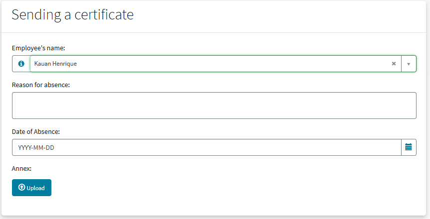
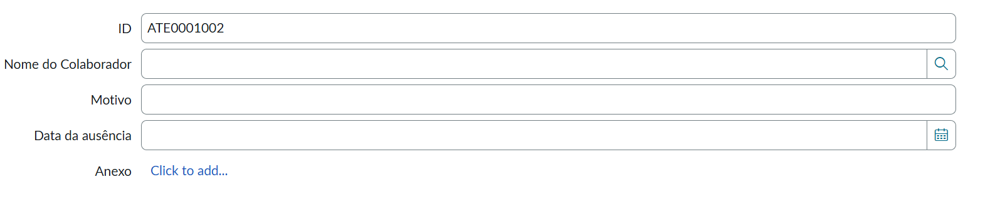
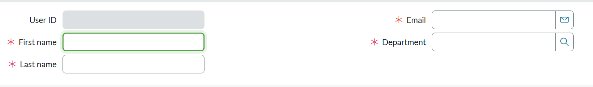
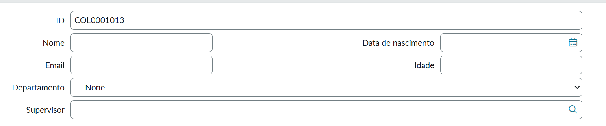
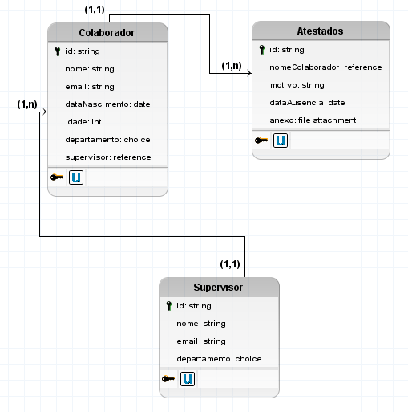
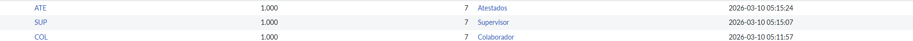
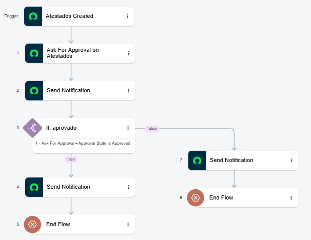

# Projeto - Envio de Atestado

Como atividade proposta na **Trilha de ServiceNow Estagiários EDX** foi um prática de **Envio de Atestado Médicos** utilizando a plataforma do *ServiceNow*.

## 📃 Tabelas

- Atestados
- Supervisor
- Colaborador

## Adicionais

- Número únicos e automáticos de ID para as três tabelas
- Cálculo automático de idade de acordo com a Data de Nascimento
- Ask for Approval do Supervisor
- User ID automático

## 💻 Record Producer

- Envio de Atestado (para tabela Atestados)



## Form - Atestados


## Form - Supervisor


## Form - Colaborador


## 🎲 Modelo Lógico


Sistema utilizado: *BrModelo*

## 🆔 Números únicos e automáticos de ID para as três tabelas


Sistema utilizado: *ServiceNow - Number Maintenance*

## ➕ Cálculo automático de idade de acordo com a Data de Nascimento

```bash
function onChange(control, oldValue, newValue, isLoading, isTemplate) {
   if (isLoading || newValue === '') {
      return;
   }

   var birthDate = new Date(newValue);
   var today = new Date();

   var age = today.getFullYear() - birthDate.getFullYear();
   var m = today.getMonth() - birthDate.getMonth();
   var d = today.getDate() - birthDate.getDate();

   if ( m< 0 || (m === 0 && d < 0)) {
		age--;
   }

   g_form.setValue('idade', age);

   //Type appropriate comment here, and begin script below
   
}
```

Linguagem utilizada: *JavaScript*

## ✅ Ask for Approval do Supervisor


Sistema utilizado: *ServiceNow - Flow Designer*